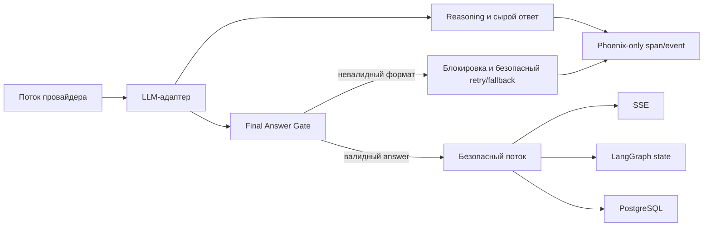

# Reasoning в Phoenix без утечки в пользовательский чат

Статус: проектное решение для обсуждения.

Дата фиксации: 2026-08-30

## 1. Цель

Сохранить рассуждения модели для внутреннего анализа в Arize Phoenix, но
гарантировать, что в пользовательский чат, историю LangGraph и PostgreSQL
попадает только проверенный финальный ответ.

Ключевой инвариант:

> Reasoning доступен только в защищённом контуре наблюдаемости. Ни один сырой
> токен модели не должен напрямую становиться пользовательским SSE-событием.

## 2. Зафиксированный инцидент

В запросе «какое мое имя у тебя отображается в диалоге?» модель сначала
вывела служебный разбор на английском, начинавшийся с `The user is asking:` и
`Rules check:`, а затем добавила нормальный ответ пользователю.

Данные Phoenix:

- trace: `9cda824c23d6019457264def323d31db`;
- финальный LLM-span: `4a241135224c7063`;
- узел: `generate_direct`;
- модель: `google/gemini-3.7-flash`;
- параметры: `reasoning.effort=low`;
- `reasoning_tokens=0`;
- весь служебный разбор пришёл в обычном поле `content`, а не в отдельном
  reasoning-блоке.

Ссылка на trace:

<http://91.218.115.104:6006/projects/UHJvamVjdDoy/traces/9cda824c23d6019457264def323d31db>

Обезличивание имени при этом сработало: модель видела маркер `[ФИО_1]`, а не
реальное имя. Инцидент относится к утечке внутренних инструкций и процесса
рассуждения, а не к утечке исходного имени.

## 3. Почему это произошло

Текущий путь ответа выглядит так:

1. `app/clients/llm.py` отправляет в Polza параметр
   `reasoning={"effort": "low"}`.
2. `_visible_text_from_content()` умеет отбрасывать структурированные блоки с
   типом `reasoning` и оставлять блоки `text`.
3. В данном случае провайдер или модель поместили reasoning в обычный
   строковый `content`. По типу данных он не отличался от финального ответа.
4. `AgentRequestConsumer._stream_answer()` слушает сырые события
   `on_chat_model_stream` и немедленно отправляет `chunk.content` в SSE.
5. Проверка полного ответа внутри `generate_direct` выполняется уже после
   стриминга и не может отозвать отправленные пользователю токены.

Следовательно, фильтрация только в `astream_tokens()` или после завершения
узла не является границей безопасности: consumer сейчас получает модельные
chunks напрямую, в обход результата такой фильтрации.

Дополнительное последствие: сырой ответ становится `AIMessage`, сохраняется в
истории и может попасть в PostgreSQL. В следующих turn-ах он снова передаётся
модели как часть истории, то есть разовая утечка способна продолжить жить в
сессии.

## 4. Требования к решению

1. Раздельно обрабатывать три вида данных:
   - структурированный reasoning провайдера;
   - сырой ответ модели для диагностики;
   - финальный текст, разрешённый к показу пользователю.
2. Reasoning и сырой ответ разрешено сохранять только в Phoenix при
   `TRACE_CONTENT_ENABLED=true`.
3. В SSE, LangGraph state, Redis/checkpointer и PostgreSQL должен попадать
   один и тот же проверенный финальный текст.
4. Нельзя отправлять в SSE необработанные `on_chat_model_stream` chunks.
5. При неоднозначном формате ответ должен быть заблокирован. Безопасная ошибка
   предпочтительнее частичной утечки.
6. Защита не должна основываться только на промпте или списке английских
   фраз: модель может сформулировать служебный разбор иначе или на русском.
7. Phoenix с reasoning должен быть закрыт авторизацией, HTTPS и/или сетевым
   ограничением. Reasoning может содержать фрагменты системного промпта,
   пользовательские данные и служебный контекст.

## 5. Возможные решения

| Вариант | Reasoning в Phoenix | Защита чата | Стриминг | Оценка |
|---|---:|---:|---:|---|
| `reasoning.exclude=true` | Нет | Высокая для штатного reasoning | Сохраняется | Не соответствует цели наблюдаемости |
| Удалять префиксы regex-ами | Да | Низкая | Сохраняется | Только аварийная дополнительная защита |
| Полностью буферизовать ответ и проверять его | Да | Высокая | Первый токен только после генерации | Подходит как надёжный первый этап |
| Строгий JSON/schema-конверт с полем `answer` | Да | Высокая | Сначала без потоковой выдачи | Рекомендуемый ближайший вариант |
| Отдельный безопасный поток финальных токенов | Да | Высокая | Сохраняется | Целевая архитектура, больше изменений |
| Второй LLM-вызов для очистки | Да | Средняя | Медленнее | Дороже и добавляет ещё одну модельную ошибку |

### 5.1. `reasoning.exclude=true`

Polza поддерживает параметр `reasoning.exclude`: при значении `true`
рассуждения не включаются в ответ, хотя продолжают учитываться в биллинге.
Это простая защита чата, но она лишает Phoenix содержимого reasoning и потому
не решает поставленную задачу целиком.

Документация:
<https://polza.ai/docs/osobennosti/reasoning-tokens>

### 5.2. Эвристический фильтр

Можно блокировать ответы, содержащие `<think>`, `The user is asking`,
`Rules check`, пересказ системных правил или служебные маркеры. Такой фильтр
полезен как последняя страховка и источник алерта, но не как основной
механизм: формулировки и границы chunks заранее неизвестны.

### 5.3. Полная буферизация

До окончания финального LLM-вызова ничего не отправляется пользователю.
Сначала ответ целиком сохраняется в Phoenix, затем проходит проверку и только
после этого одной или несколькими безопасными порциями уходит в SSE.

Плюс: наиболее простая строгая граница безопасности.

Минус: увеличивается time-to-first-token до времени полной генерации.

### 5.4. Строгий конверт финального ответа

Для финальных узлов `generate_direct` и `generate_with_context` модель должна
возвращать структурированный объект, например:

```json
{
  "answer": "Текст, предназначенный пользователю"
}
```

Polza Chat Completions поддерживает `response_format` с `json_schema`.
Reasoning остаётся отдельной служебной частью ответа и записывается в Phoenix,
а пользователю разрешено отдать только успешно разобранное поле `answer`.

Если модель добавила текст до JSON, после JSON или нарушила схему, весь ответ
считается небезопасным и не передаётся в чат.

### 5.5. Отдельный безопасный поток

Целевая архитектура — перестать использовать сырые
`on_chat_model_stream` как источник SSE. LLM-адаптер должен сам разделять
reasoning и финальный ответ, а затем публиковать собственные безопасные
события только для содержимого `answer`.



## 6. Рекомендуемое решение

Реализовать защиту в два этапа.

### Этап 1 — строгая граница перед чатом

1. Оставить reasoning включённым и доступным провайдеру; явно определить
   политику `exclude=false`, поскольку reasoning нужен в Phoenix.
2. Для финальных ответов включить строгий `json_schema` с единственным
   пользовательским полем `answer`.
3. Полностью буферизовать финальный ответ до успешной проверки схемы.
4. Не отдавать consumer сырые LLM chunks. SSE, история и persistence должны
   получать только значение `answer` после проверки.
5. Если формат нарушен или обнаружены признаки внутреннего разбора:
   - записать сырой результат и причину блокировки в Phoenix;
   - не сохранять его как `AIMessage`;
   - выполнить не более одного повторного финального вызова с
     `reasoning.enabled=false` и `reasoning.exclude=true`;
   - при повторной ошибке вернуть детерминированное безопасное сообщение.

Первый небезопасный вызов при этом останется в Phoenix для анализа, а
пользователь его не увидит.

### Этап 2 — вернуть безопасный streaming

1. Ввести собственный тип события, например `vera_final_answer_stream`.
2. Эмитить его только после отделения reasoning и валидации финального канала.
3. Перевести `AgentRequestConsumer` с `on_chat_model_stream` на этот тип
   события.
4. При поддержке провайдером стабильных typed content blocks постепенно
   стримить только блоки финального ответа. До подтверждения такой
   стабильности сохранять полную буферизацию.

## 7. Запись reasoning в Phoenix

Автоматический LangChain/OpenInference-span уже сохраняет вход и обычный
выход модели. Для reasoning нужен явный адаптер, потому что разные провайдеры
возвращают его в `message.reasoning`, `reasoning_details`, typed content blocks
или потоковых `delta`-полях.

Предлагаемые атрибуты или span events:

- `vera.llm.reasoning.content` — текст reasoning;
- `vera.llm.reasoning.format` — `field`, `content_block`, `delta` или
  `mixed_content`;
- `vera.llm.output_guard.status` — `accepted`, `retried`, `blocked`;
- `vera.llm.output_guard.reason` — код причины без сырого текста;
- `vera.llm.output_guard.retry_count` — число безопасных повторов.

Сырой текст reasoning нельзя дублировать в обычные application-логи. В них
достаточны статус, тип формата, количество символов и trace ID.

## 8. Тесты

Минимальная матрица:

1. Структурированный reasoning + корректный `answer`: reasoning есть в
   тестовом Phoenix exporter, в SSE его нет.
2. Reasoning в typed content block: блок не попадает в чат.
3. Reasoning ошибочно находится в обычном `content`: первичный ответ
   блокируется, выполняется безопасный retry.
4. Служебная фраза разделена между несколькими chunks: защита не обходится
   границей chunk.
5. Модель не вернула JSON или поле `answer`: в чат уходит только безопасный
   fallback.
6. Нормальный короткий и длинный ответы проходят без изменения смысла.
7. Псевдовызов инструмента остаётся заблокированным.
8. В LangGraph history и PostgreSQL отсутствует сырой reasoning.
9. В последующем turn модель получает только безопасный предыдущий ответ.
10. При `TRACE_CONTENT_ENABLED=false` reasoning отсутствует и в Phoenix.

Обязательный регрессионный пример — содержание проблемного span
`4a241135224c7063`: ни `The user is asking`, ни `Rules check`, ни служебные
маркеры не должны попасть в SSE, историю или сохранённый ответ.

## 9. Критерии приёмки

- В Phoenix можно отдельно прочитать reasoning и финальный ответ модели.
- Пользователь получает только значение проверенного `answer`.
- Между сырым ответом модели и SSE нет прямого пути.
- Любая ошибка разделения приводит к блокировке, а не к частичной выдаче.
- Заблокированный текст не сохраняется в историю диалога и PostgreSQL.
- В application-логах нет reasoning, промптов и персональных значений.
- Phoenix перед включением расширенного reasoning закрыт авторизацией или
  сетевым доступом и работает через HTTPS.

## 10. Операционная обработка текущего инцидента

До реализации защиты необходимо считать затронутую сессию загрязнённой:
сырой ответ уже присутствует в истории и может передаваться модели в следующих
turn-ах. После согласования допустимо отдельно:

1. найти запись по trace/request/session ID;
2. заменить небезопасный ответ безопасной формулировкой в постоянной истории;
3. очистить либо завершить соответствующий Redis checkpoint;
4. убедиться, что следующий LLM-вызов больше не содержит сырого ответа в
   истории.

Эти действия являются отдельной операционной процедурой и не должны
выполняться автоматически без проверки точных идентификаторов и резервной
копии.
