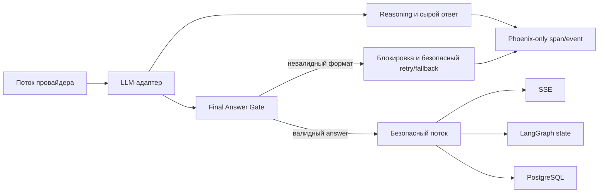

# Reasoning в Phoenix без утечки в пользовательский чат

Статус: реализовано 2026-08-31. Итоговая архитектура и результаты проверки
зафиксированы в разделах 12–13. При противоречии с прежними вариантами
приоритет имеют разделы 12–13.

Дата фиксации: 2026-08-30. Дата реализации: 2026-08-31.

## 1. Цель

Сохранить рассуждения модели для внутреннего анализа в Arize Phoenix, но
гарантировать, что в пользовательский чат, историю LangGraph и PostgreSQL
попадает только проверенный финальный ответ.

Ключевой инвариант:

> Reasoning доступен только в защищённом контуре наблюдаемости. Ни один сырой
> токен модели не должен напрямую становиться пользовательским SSE-событием.

## 2. Зафиксированный инцидент

В запросе «какое мое имя у тебя отображается в диалоге?» модель сначала
вывела служебный разбор на английском, начинавшийся с `The user is asking:` и
`Rules check:`, а затем добавила нормальный ответ пользователю.

Данные Phoenix:

- trace: `9cda824c23d6019457264def323d31db`;
- финальный LLM-span: `4a241135224c7063`;
- узел: `generate_direct`;
- модель: `google/gemini-3.7-flash`;
- параметры: `reasoning.effort=low`;
- `reasoning_tokens=0`;
- весь служебный разбор пришёл в обычном поле `content`, а не в отдельном
  reasoning-блоке.

Ссылка на trace:

<http://91.218.115.104:6006/projects/UHJvamVjdDoy/traces/9cda824c23d6019457264def323d31db>

Обезличивание имени при этом сработало: модель видела маркер `[ФИО_1]`, а не
реальное имя. Инцидент относится к утечке внутренних инструкций и процесса
рассуждения, а не к утечке исходного имени.

## 3. Почему это произошло

Текущий путь ответа выглядит так:

1. `app/clients/llm.py` отправляет в Polza параметр
   `reasoning={"effort": "low"}`.
2. `_visible_text_from_content()` умеет отбрасывать структурированные блоки с
   типом `reasoning` и оставлять блоки `text`.
3. В данном случае провайдер или модель поместили reasoning в обычный
   строковый `content`. По типу данных он не отличался от финального ответа.
4. `AgentRequestConsumer._stream_answer()` слушает сырые события
   `on_chat_model_stream` и немедленно отправляет `chunk.content` в SSE.
5. Проверка полного ответа внутри `generate_direct` выполняется уже после
   стриминга и не может отозвать отправленные пользователю токены.

Следовательно, фильтрация только в `astream_tokens()` или после завершения
узла не является границей безопасности: consumer сейчас получает модельные
chunks напрямую, в обход результата такой фильтрации.

Дополнительное последствие: сырой ответ становится `AIMessage`, сохраняется в
истории и может попасть в PostgreSQL. В следующих turn-ах он снова передаётся
модели как часть истории, то есть разовая утечка способна продолжить жить в
сессии.

## 4. Требования к решению

1. Раздельно обрабатывать три вида данных:
   - структурированный reasoning провайдера;
   - сырой ответ модели для диагностики;
   - финальный текст, разрешённый к показу пользователю.
2. Reasoning и сырой ответ разрешено сохранять только в Phoenix при
   `TRACE_CONTENT_ENABLED=true`.
3. В SSE, LangGraph state, Redis/checkpointer и PostgreSQL должен попадать
   один и тот же проверенный финальный текст.
4. Нельзя отправлять в SSE необработанные `on_chat_model_stream` chunks.
5. При неоднозначном формате ответ должен быть заблокирован. Безопасная ошибка
   предпочтительнее частичной утечки.
6. Защита не должна основываться только на промпте или списке английских
   фраз: модель может сформулировать служебный разбор иначе или на русском.
7. Phoenix с reasoning должен быть закрыт авторизацией, HTTPS и/или сетевым
   ограничением. Reasoning может содержать фрагменты системного промпта,
   пользовательские данные и служебный контекст.

## 5. Возможные решения

| Вариант | Reasoning в Phoenix | Защита чата | Стриминг | Оценка |
|---|---:|---:|---:|---|
| `reasoning.exclude=true` | Нет | Высокая для штатного reasoning | Сохраняется | Не соответствует цели наблюдаемости |
| Удалять префиксы regex-ами | Да | Низкая | Сохраняется | Только аварийная дополнительная защита |
| Полностью буферизовать ответ и проверять его | Да | Высокая | Первый токен только после генерации | Подходит как надёжный первый этап |
| Строгий JSON/schema-конверт с полем `answer` | Да | Высокая | Сначала без потоковой выдачи | Рекомендуемый ближайший вариант |
| Отдельный безопасный поток финальных токенов | Да | Высокая | Сохраняется | Целевая архитектура, больше изменений |
| Второй LLM-вызов для очистки | Да | Средняя | Медленнее | Дороже и добавляет ещё одну модельную ошибку |

### 5.1. `reasoning.exclude=true`

Polza поддерживает параметр `reasoning.exclude`: при значении `true`
рассуждения не включаются в ответ, хотя продолжают учитываться в биллинге.
Это простая защита чата, но она лишает Phoenix содержимого reasoning и потому
не решает поставленную задачу целиком.

Документация:
<https://polza.ai/docs/osobennosti/reasoning-tokens>

### 5.2. Эвристический фильтр

Можно блокировать ответы, содержащие `<think>`, `The user is asking`,
`Rules check`, пересказ системных правил или служебные маркеры. Такой фильтр
полезен как последняя страховка и источник алерта, но не как основной
механизм: формулировки и границы chunks заранее неизвестны.

### 5.3. Полная буферизация

До окончания финального LLM-вызова ничего не отправляется пользователю.
Сначала ответ целиком сохраняется в Phoenix, затем проходит проверку и только
после этого одной или несколькими безопасными порциями уходит в SSE.

Плюс: наиболее простая строгая граница безопасности.

Минус: увеличивается time-to-first-token до времени полной генерации.

### 5.4. Строгий конверт финального ответа

Для финальных узлов `generate_direct` и `generate_with_context` модель должна
возвращать структурированный объект, например:

```json
{
  "answer": "Текст, предназначенный пользователю"
}
```

Polza Chat Completions поддерживает `response_format` с `json_schema`.
Reasoning остаётся отдельной служебной частью ответа и записывается в Phoenix,
а пользователю разрешено отдать только успешно разобранное поле `answer`.

Если модель добавила текст до JSON, после JSON или нарушила схему, весь ответ
считается небезопасным и не передаётся в чат.

### 5.5. Отдельный безопасный поток

Целевая архитектура — перестать использовать сырые
`on_chat_model_stream` как источник SSE. LLM-адаптер должен сам разделять
reasoning и финальный ответ, а затем публиковать собственные безопасные
события только для содержимого `answer`.



## 6. Рекомендуемое решение

Реализовать защиту в два этапа.

### Этап 1 — строгая граница перед чатом

1. Оставить reasoning включённым и доступным провайдеру; явно определить
   политику `exclude=false`, поскольку reasoning нужен в Phoenix.
2. Для финальных ответов включить строгий `json_schema` с единственным
   пользовательским полем `answer`.
3. Полностью буферизовать финальный ответ до успешной проверки схемы.
4. Не отдавать consumer сырые LLM chunks. SSE, история и persistence должны
   получать только значение `answer` после проверки.
5. Если формат нарушен или обнаружены признаки внутреннего разбора:
   - записать сырой результат и причину блокировки в Phoenix;
   - не сохранять его как `AIMessage`;
   - выполнить не более одного повторного финального вызова с
     `reasoning.enabled=false` и `reasoning.exclude=true`;
   - при повторной ошибке вернуть детерминированное безопасное сообщение.

Первый небезопасный вызов при этом останется в Phoenix для анализа, а
пользователь его не увидит.

### Этап 2 — вернуть безопасный streaming

1. Ввести собственный тип события, например `vera_final_answer_stream`.
2. Эмитить его только после отделения reasoning и валидации финального канала.
3. Перевести `AgentRequestConsumer` с `on_chat_model_stream` на этот тип
   события.
4. При поддержке провайдером стабильных typed content blocks постепенно
   стримить только блоки финального ответа. До подтверждения такой
   стабильности сохранять полную буферизацию.

## 7. Запись reasoning в Phoenix

Автоматический LangChain/OpenInference-span уже сохраняет вход и обычный
выход модели. Для reasoning нужен явный адаптер, потому что разные провайдеры
возвращают его в `message.reasoning`, `reasoning_details`, typed content blocks
или потоковых `delta`-полях.

Предлагаемые атрибуты или span events:

- `vera.llm.reasoning.content` — текст reasoning;
- `vera.llm.reasoning.format` — `field`, `content_block`, `delta` или
  `mixed_content`;
- `vera.llm.output_guard.status` — `accepted`, `retried`, `blocked`;
- `vera.llm.output_guard.reason` — код причины без сырого текста;
- `vera.llm.output_guard.retry_count` — число безопасных повторов.

Сырой текст reasoning нельзя дублировать в обычные application-логи. В них
достаточны статус, тип формата, количество символов и trace ID.

## 8. Тесты

Минимальная матрица:

1. Структурированный reasoning + корректный `answer`: reasoning есть в
   тестовом Phoenix exporter, в SSE его нет.
2. Reasoning в typed content block: блок не попадает в чат.
3. Reasoning ошибочно находится в обычном `content`: первичный ответ
   блокируется, выполняется безопасный retry.
4. Служебная фраза разделена между несколькими chunks: защита не обходится
   границей chunk.
5. Модель не вернула JSON или поле `answer`: в чат уходит только безопасный
   fallback.
6. Нормальный короткий и длинный ответы проходят без изменения смысла.
7. Псевдовызов инструмента остаётся заблокированным.
8. В LangGraph history и PostgreSQL отсутствует сырой reasoning.
9. В последующем turn модель получает только безопасный предыдущий ответ.
10. При `TRACE_CONTENT_ENABLED=false` reasoning отсутствует и в Phoenix.

Обязательный регрессионный пример — содержание проблемного span
`4a241135224c7063`: ни `The user is asking`, ни `Rules check`, ни служебные
маркеры не должны попасть в SSE, историю или сохранённый ответ.

## 9. Критерии приёмки

- В Phoenix можно отдельно прочитать reasoning и финальный ответ модели.
- Пользователь получает только значение проверенного `answer`.
- Между сырым ответом модели и SSE нет прямого пути.
- Любая ошибка разделения приводит к блокировке, а не к частичной выдаче.
- Заблокированный текст не сохраняется в историю диалога и PostgreSQL.
- В application-логах нет reasoning, промптов и персональных значений.
- Phoenix перед включением расширенного reasoning закрыт авторизацией или
  сетевым доступом и работает через HTTPS.

## 10. Операционная обработка текущего инцидента

До реализации защиты необходимо считать затронутую сессию загрязнённой:
сырой ответ уже присутствует в истории и может передаваться модели в следующих
turn-ах. После согласования допустимо отдельно:

1. найти запись по trace/request/session ID;
2. заменить небезопасный ответ безопасной формулировкой в постоянной истории;
3. очистить либо завершить соответствующий Redis checkpoint;
4. убедиться, что следующий LLM-вызов больше не содержит сырого ответа в
   истории.

Эти действия являются отдельной операционной процедурой и не должны
выполняться автоматически без проверки точных идентификаторов и резервной
копии.

---

## 11. Комментарии агента-ревьювера

Статус: внешнее ревью разделов 1–10.

Дата ревью: 2026-08-30. Код на момент ревью: ветка `main`, коммит `3b1e49d`.

### 11.1. Общая оценка

Диагноз в разделе 3 верен и подтверждается кодом построчно. Требования
раздела 4 сформулированы правильно и пересмотра не требуют. Возражения
касаются только выбора механизма (раздел 5) и порядка этапов (раздел 6).

Главный вывод ревью: рекомендуемый в разделе 6 порядок стоит развернуть.
Вариант 5.5 («отдельный безопасный поток») описан как «целевая архитектура,
больше изменений», но по факту это самое дешёвое из перечисленного и
единственное, что устраняет причину, а не следствие. Вариант 5.4
(`json_schema`) решает более узкую задачу, чем предполагает раздел 6, и
границей безопасности не является.

### 11.2. Подтверждение диагноза по коду

Пункт 4 раздела 3 подтверждается точно:

- `app/messaging/consumer.py:912-932` — SSE-поток формируется напрямую из
  `event['data']['chunk'].content` события `on_chat_model_stream`;
- фильтр `_visible_text_from_content()` (`app/clients/llm.py:36`) вызывается
  только внутри `astream_tokens()` (`app/clients/llm.py:161-196`), то есть
  применяется к значению, которое получает **узел графа**;
- consumer подписан на события LangChain параллельно узлу и получает chunks
  независимо от какой-либо обработки внутри `astream_tokens()`.

Формулировку раздела 3 стоит усилить: на пути к SSE фильтрации reasoning нет
не «недостаточно», а нет вообще. Существующий фильтр структурированных
reasoning-блоков к пользовательскому чату отношения не имеет ни в каком
сценарии, включая штатный.

Единственная действующая проверка SSE-потока — `contains_pseudo_tool_call()`
(`app/graph/policy.py:22`), работающая по списку из пяти строковых маркеров
(`app/graph/policy.py:13`). Служебный разбор вида `The user is asking:` под
неё не попадает по построению, а не по недосмотру.

### 11.3. Существенное уточнение: финальные узлы уже буферизуют ответ

Раздел 5.3 оценивает полную буферизацию как отдельную работу с потерей
time-to-first-token. Это неточно: буферизация в узлах **уже реализована**.

`app/graph/nodes/generate_direct.py:71-85` и
`app/graph/nodes/generate_with_context.py:64-81` устроены одинаково:

```python
full_text = ''
async for token in astream_tokens(chat_model, messages):
    full_text += token

if not full_text:
    raise EmptyLlmStreamError

if contains_pseudo_tool_call(full_text):
    return {'messages': [AIMessage(content=UNSAFE_TOOL_CALL_RESPONSE)]}

return {'messages': [AIMessage(content=full_text)]}
```

Узел не отдаёт токены наружу по мере поступления. Он накапливает весь ответ,
проверяет его целиком и только потом возвращает `AIMessage`. То есть проверка
полного текста уже существует, уже корректна и уже применяется к истории и
persistence.

Практические следствия, которые надо внести в разделы 5 и 6:

1. Вариант 5.3 не требует переписывания узлов. Реализация сводится к тому,
   чтобы consumer перестал слушать `on_chat_model_stream` и отдавал в SSE
   финальный `AIMessage`. Механизм для этого в consumer тоже уже есть —
   ветка `deferred_answer` (`consumer.py:899-919`), которая сейчас
   используется как запасной путь для детерминированного ответа email-тулы.
2. Единственная реальная цена варианта 5.3 — time-to-first-token, равный
   времени полной генерации. Никакой другой стоимости у него нет.
3. Комментарий в `generate_with_context.py:73-74` («узел всё равно может быть
   вызван напрямую, мимо consumer») показывает, что расхождение двух путей
   выдачи было замечено при написании кода, но трактовалось как страховка для
   прямых вызовов, а не как основной канал. Стоит зафиксировать это в
   разделе 3 как причину, по которой дефект дожил до продакшена.

### 11.4. Дополнение к разделу 3: защита SSE не хранит состояние между chunks

Раздел 8 упоминает разрыв служебной фразы между chunks только как тестовый
случай (пункт 8.4). В действующем коде это уже воспроизводимый дефект,
независимый от reasoning и существующий прямо сейчас.

`consumer.py:928` вызывает `contains_pseudo_tool_call(content)` для каждого
chunk по отдельности, состояние между вызовами не сохраняется. Псевдовызов
`send_consultation_email(`, пришедший двумя chunks (`send_consultation_` и
`email(`), не распознаётся ни этой проверкой, ни какой-либо другой на пути к
SSE, и попадает пользователю целиком.

Дополнительно: флаг `blocked_pseudo_output` (`consumer.py:930`) взводится
только для отброшенного chunk. Токены, отправленные до него, у пользователя
уже отображены и отозваны быть не могут — то же ограничение, что и для
reasoning.

Это надо внести в раздел 3 отдельным подпунктом. Любое выбранное решение
обязано чинить и его: устранение reasoning-утечки без устранения
chunk-границы оставляет эксплуатируемый канал того же класса.

### 11.5. Возражение к варианту 5.4 и этапу 1 раздела 6

`json_schema` с полем `answer` не является границей безопасности, потому что
решение о том, что положить в поле `answer`, принимает та же самая модель.

Конверт защищает ровно от одного сценария — «текст до или после JSON». Он не
защищает от сценария «служебный разбор внутри `answer`», а именно этот
сценарий и наблюдался в инциденте: модель не добавила reasoning отдельным
блоком, она сгенерировала его как часть обычного текста ответа. Модель,
которая делает это в `content`, ровно так же сделает это внутри `answer` —
схема будет валидна, парсинг успешен, гейт пропустит.

Формулировка раздела 5.4 «если модель добавила текст до JSON, после JSON или
нарушила схему, весь ответ считается небезопасным» верна, но описывает защиту
от менее вероятного варианта отказа.

Дополнительные издержки, которые в разделе 6 не учтены:

- `response_format` заметно снижает качество на слабых и локальных моделях и
  добавляет новый класс отказов (невалидный JSON), то есть повышает частоту
  срабатывания fallback;
- экранирование внутри JSON-строки ломает потоковую выдачу принципиально:
  отдавать частично разобранный JSON пользователю нельзя, поэтому вариант 5.4
  жёстко требует буферизации и не является ступенькой к этапу 2;
- к текущему коду конфликта с tool-calls нет — финальные узлы вызывают
  `chat_model` без `bind_tools` (`generate_direct.py:72`,
  `generate_with_context.py:65`), инструменты привязаны только в
  `analyze_intent` (`analyze_intent.py:70`). Это единственный риск, которого
  можно не опасаться.

Рекомендация: перенести `json_schema` из этапа 1 в опциональные меры. Взять
его имеет смысл только если после внедрения гейта в логах будет видно, что
модель регулярно смешивает разбор с ответом и эвристики не справляются.

### 11.6. Рекомендация: вариант 5.5 первым этапом, и он дешевле, чем оценён

Причина инцидента одна — consumer читает сырой модельный поток напрямую.
Устраняется она одним изменением: узел сам публикует токены в собственный
канал, consumer читает только его.

Обе технические возможности в текущих версиях зависимостей доступны
(`langgraph==1.2.8`, `langchain-core==1.4.9`, Python 3.12 — проверено):

Вариант А, минимальные изменения в consumer. Узел эмитит событие через
`adispatch_custom_event`, оно приходит в уже используемый
`astream_events(version='v2')` как `on_custom_event`:

```python
from langchain_core.callbacks import adispatch_custom_event

async for token in astream_tokens(chat_model, messages):
    full_text += token
    if (safe := gate.push(token)):
        await adispatch_custom_event('vera_final_answer_stream', {'text': safe})
```

В consumer подписка `on_chat_model_stream` заменяется на `on_custom_event` с
именем `vera_final_answer_stream`. Вся остальная логика сбора финального
snapshot (`consumer.py:870-919`) не меняется. На Python 3.12 контекст
callbacks пробрасывается автоматически, ручной передачи `config` не нужно.

Вариант Б, более идиоматичный для LangGraph: `get_stream_writer()` из
`langgraph.config` и переход consumer с `astream_events` на
`astream(stream_mode=['custom', 'values'])`. Чище архитектурно, но требует
переписать разбор финального snapshot, который сейчас завязан на структуру
событий `astream_events`.

Рекомендуется вариант А как первый шаг: он даёт ту же границу безопасности
при несопоставимо меньшем объёме изменений, а переход на вариант Б можно
сделать позже отдельно.

Ключевое следствие: после этого изменения `astream_tokens()` и проверка
`full_text` в узле впервые становятся настоящей границей, а не декоративной.
Вся фильтрация оказывается в одном месте, и любое новое правило достаточно
добавить туда.

### 11.7. Недостающая строка в таблице раздела 5: гейт со скользящим окном

В таблице отсутствует промежуточный вариант между «полной буферизацией» и
«стримингом как есть». Он закрывает и chunk-границу из 11.4, и TTFT.

Идея: узел накапливает `full_text`, но наружу отдаёт только тот префикс,
который уже гарантированно не может оказаться началом запрещённой
конструкции. Удерживается хвост фиксированной длины.

Размер хвоста прямо определяет прирост time-to-first-token, поэтому его надо
брать минимально достаточным, а не «с запасом». Достаточное значение — длина
самого длинного маркера минус один символ: самый длинный сейчас
`send_consultation_email{` (24 символа, `app/graph/policy.py:13`). С учётом
решающего правила из 11.8, которому нужны первые 40–60 символов ответа,
разумное значение — **64 символа**. При типовой скорости генерации 40–60
токенов в секунду это задержка порядка 0,3–0,4 с. Значение 256 символов, взятое
«с запасом», дало бы уже около 1,5 с и обесценило бы весь смысл варианта.

```python
class OutputGate:
    """Отдаёт наружу только безопасный префикс, удерживая хвост."""

    def __init__(self, tail: int = 64) -> None:
        self._buffer = ''
        self._tail = tail
        self._released = 0

    def push(self, token: str) -> str:
        self._buffer += token
        if self._released == 0 and not self._prefix_is_safe():
            return ''
        cut = len(self._buffer) - self._tail
        if cut <= self._released:
            return ''
        chunk = self._buffer[self._released:cut]
        self._released = cut
        return chunk

    def flush(self) -> str:
        chunk = self._buffer[self._released:]
        self._released = len(self._buffer)
        return chunk
```

Свойства:

- проверка ведётся по накопленному тексту, а не по отдельному chunk, поэтому
  разрыв маркера между chunks перестаёт что-либо обходить;
- первые токены задерживаются на длину окна, а не на всю генерацию: при
  хвосте в 64 символа это 0,3–0,4 с против нескольких секунд полной
  генерации;
- при срабатывании проверки до первой выдачи (`self._released == 0`) поток
  блокируется целиком и пользователь не видит ничего — то есть выполняется
  требование 4.5 «безопасная ошибка предпочтительнее частичной выдачи»;
- после начала выдачи гейт уже не может отозвать отправленное — это
  остаточный риск, сознательно принимаемый ради TTFT. Полная буферизация
  (5.3) его не имеет.

Строку в таблицу раздела 5 предлагается добавить так:

| Вариант | Reasoning в Phoenix | Защита чата | Стриминг | Оценка |
|---|---:|---:|---:|---|
| Гейт со скользящим окном | Да | Высокая до первой выдачи, средняя после | Сохраняется, TTFT + окно | Практический компромисс |

### 11.8. Уточнение к варианту 5.2: эвристики надо привязать к началу ответа

Оценка «низкая защита» для эвристик справедлива для поиска фраз по всему
тексту, но недооценивает частный случай, который в инциденте и наблюдался.

Утечка внутреннего разбора практически всегда начинается **с первого токена**:
модель сначала пишет разбор, потом ответ. Именно так и выглядит span
`4a241135224c7063` — ответ начинается с `The user is asking:`.

Из этого следует практичная формулировка правила, которой нет в документе:
проверять не «есть ли где-то в тексте служебная фраза», а «похожи ли первые
N символов ответа на служебный разбор». Такое правило:

- почти не даёт ложных срабатываний, потому что нормальный ответ юридического
  консультанта не начинается с английской служебной конструкции или `<think>`;
- дёшево вычисляется и естественно ложится на гейт из 11.7, где решение о
  блокировке всё равно принимается до первой выдачи;
- не зависит от языка формулировки, если строить его не только по списку фраз,
  а по признакам: ответ начинается с латиницы при русском запросе; ответ
  начинается с `<think>`, `<reasoning>`, `Rules check`, `The user`; ответ
  содержит дословные фрагменты системного промпта.

Возражение раздела 6 о том, что защита не должна основываться только на
промпте или списке английских фраз (требование 4.6), остаётся в силе:
эвристика здесь — не основной механизм, а решающее правило внутри гейта.
Основным механизмом остаётся разрыв прямого пути от модели к SSE (11.6).

### 11.9. Уточнение к разделу 10: история диалога лечится автоматически

Раздел 10 предписывает ручную операционную процедуру для загрязнённой сессии,
включая правку постоянной истории и очистку Redis-checkpoint. Часть этой
работы уже не нужна.

После коммитов обезличивания в `app/graph/context_budget.py:22` появилась
функция `_sanitize_message_for_model()`, которая вызывается на каждом
построении контекста для LLM (`build_bounded_messages()`,
`context_budget.py:92`) и подменяет небезопасный `AIMessage` на
`UNSAFE_HISTORY_ANSWER` **перед каждой отправкой модели**, не изменяя сам
checkpoint.

Значит, достаточно расширить проверку внутри `_sanitize_message_for_model()`
с `contains_pseudo_tool_call()` на новый reasoning-гейт — и любая уже
загрязнённая сессия перестаёт передавать сырой разбор модели на следующем же
turn, без ручных операций с Redis. Абзац раздела 3 о том, что «разовая утечка
способна продолжить жить в сессии», после этого изменения перестаёт
действовать.

Ручная процедура остаётся нужна только для PostgreSQL, где сохранён ответ
`answer` (`app/db/models/chat_turn.py:120`), и только если требуется убрать
запись из постоянного хранилища. Пункты 3 и 4 раздела 10 (очистка checkpoint,
проверка следующего вызова) при этом становятся необязательными.

### 11.10. Что необходимо проверить до начала реализации

В разделе 2 зафиксировано `reasoning_tokens=0` при `reasoning.effort=low`. Это
внутренне противоречиво и требует проверки, потому что от результата зависит,
нужен ли раздел 7 вообще.

Гипотеза: Polza для модели `google/gemini-3.7-flash` не поддерживает параметр
`reasoning` и молча его игнорирует. Параметр передаётся через `extra_body`
(`app/clients/llm.py:96-102`), то есть при отсутствии поддержки провайдер
просто не вернёт ошибку. В этом случае то, что пришло в `content`, — вообще не
reasoning-канал, а обычный ответ модели, плохо следующей системному промпту.

Проверка — один вызов к API с тем же телом запроса и осмотром сырого ответа на
наличие полей `reasoning`, `reasoning_details`, `reasoning_content`.

Последствия для плана:

- если reasoning-канал есть — раздел 7 реализуется как описано;
- если его нет — раздел 7 записывать нечего, атрибуты `vera.llm.reasoning.*`
  смысла не имеют, и весь документ сводится к output-гейту (разделы
  11.6–11.8). Это примерно половина объёма работ.

Проверку стоит выполнить до планирования спринта, а не в его ходе.

### 11.11. Связь с обезличиванием персональных данных

Раздел 2 верно отмечает, что имя не утекло: модель видела `[ФИО_1]`. Стоит
дописать два следствия, которые из этого вытекают и влияют на раздел 7.

Во-первых, reasoning, сохранённый в Phoenix, будет содержать маркеры, а не
реальные значения. Разбирать по Phoenix инциденты с персональными данными
невозможно и не планируется — это ожидаемое поведение, а не ограничение,
которое надо обходить. Попытка сохранять в Phoenix «настоящие» значения ради
удобства анализа противоречила бы принятому решению об обезличивании.

Во-вторых, reasoning содержит фрагменты системного промпта и служебного
контекста. Поэтому требование 4.7 (авторизация, HTTPS, сетевое ограничение)
следует переформулировать из пожелания в обязательное предусловие: расширенная
запись reasoning не включается до закрытия Phoenix. Сейчас в разделе 2 указан
адрес `http://91.218.115.104:6006` — открытый HTTP на публичном IP.

### 11.12. Пересобранный план работ

Предлагается заменить порядок из раздела 6 следующим.

Этап 0 — проверка гипотезы про reasoning-канал (11.10). Один тестовый вызов.
Определяет, нужен ли раздел 7. Результат: понятный объём работ.

Этап 1 — разрыв прямого пути «модель → SSE» (11.6, вариант А). Узел публикует
собственное событие, consumer перестаёт слушать `on_chat_model_stream`.
Изменяются `generate_direct.py`, `generate_with_context.py`,
`consumer.py:920-932`. Результат: существующая проверка `full_text` в узлах
впервые начинает реально защищать чат, требование 4.4 выполнено, chunk-граница
из 11.4 закрыта автоматически.

Этап 2 — гейт со скользящим окном и решающим правилом (11.7 и 11.8). Новый
модуль, например `app/graph/output_gate.py`, используется и в узлах, и в
`_sanitize_message_for_model()`. Результат: reasoning блокируется до первой
выдачи, история лечится сама (11.9), TTFT практически не страдает.

Этап 3 — наблюдаемость (раздел 7, если этап 0 подтвердил наличие канала) плюс
атрибуты `vera.llm.output_guard.*` вне зависимости от результата этапа 0:
статус гейта нужен всегда. Результат: видно, как часто срабатывает блокировка.

Этап 4 — закрытие Phoenix (11.11). Предусловие для этапа 3, а не следствие.

Этап 5 — опционально `json_schema` (11.5), только если данные этапа 3 покажут,
что модель смешивает разбор с ответом достаточно часто и эвристики не
справляются.

Полная буферизация (5.3) в этом плане не нужна как отдельная работа: этап 1
уже даёт её как поведение по умолчанию, а этап 2 возвращает стриминг.

### 11.13. Влияние на скорость работы агента

Замеры выполнены на машине разработки (Python 3.12, CPU без GPU) в ходе ревью.

**Этап 1 (разрыв прямого пути модель → SSE) — нулевая цена.** Ключевое условие:
`adispatch_custom_event` вызывается **внутри** цикла `async for token in
astream_tokens(...)`, а не после него. Тогда токен уходит пользователю в тот же
момент, что и сейчас, просто по другому маршруту. Накладные расходы — один
диспатч события на токен (единицы микросекунд против десятков миллисекунд
ожидания следующего токена от провайдера). Полная буферизация возникает только
если эмитить после цикла — так делать не надо.

**Этап 2 (гейт) — фиксированные 0,3–0,4 с к time-to-first-token.** Задержка
равна времени генерации `tail` символов, см. расчёт в 11.7. Общее время ответа
не меняется: гейт задерживает начало выдачи, но не конец. Вычислительная
стоимость самого гейта — конкатенация строки и поиск подстроки на префиксе,
против сетевого ожидания это шум. При этом `full_text += token` в узлах уже
делает ровно такую же конкатенацию, то есть новых расходов не появляется.

**Этап 3 (атрибуты span) — единицы миллисекунд на запрос.** Span и так
создаётся, добавляются только атрибуты.

**Этап 5 (`json_schema`) — единственное, что реально замедляет.** Служебные
токены конверта увеличивают генерацию, а падение качества на слабых моделях
повышает частоту fallback и повторных вызовов. Ещё один довод держать его
опциональным (11.5).

Итог по документу: этапы 0–4 добавляют к времени ответа порядка 0,3–0,4 с, и
только к моменту появления первого символа, а не к полному ответу.

**Отдельно: что уже замедляет агента сейчас.** Обезличивание вызывается на
каждом построении контекста, то есть по всей истории на каждый вызов LLM
(`_sanitize_message_for_model()` в `build_bounded_messages()`,
`context_budget.py:51-57`). Измеренная стоимость:

| Длина истории | Сообщений | Время одного `build_bounded_messages` |
|---|---:|---:|
| 4 реплики | 8 | 44 мс |
| 12 реплик (значение по умолчанию) | 24 | 154 мс |
| 30 реплик | 60 | 205 мс |

Стоимость одного сообщения — 1,7 мс для короткого вопроса и 10,5 мс для
развёрнутого ответа; основное время занимает NER-проход Natasha.

За один пользовательский запрос `build_bounded_messages()` вызывается минимум
дважды (`analyze_intent`, затем один из финальных узлов), при вызове инструмента
— трижды. То есть на типовой сессии из 12 реплик это **0,3–0,45 с CPU на
запрос**, причём одни и те же сообщения истории перередактируются заново на
каждом вызове, хотя их текст не менялся.

Это в разы больше, чем цена всего плана из раздела 11.12, и устраняется
кешированием: результат обезличивания сообщения зависит только от его текста,
поэтому достаточно кеша по хешу содержимого в пределах
`pii_redaction_scope()`. Ожидаемый эффект — обезличивание одного нового
сообщения за turn вместо всей истории дважды, то есть примерно 5–10 мс вместо
300–450 мс.

Рекомендация: вынести этот кеш в отдельную задачу и делать её раньше этапов
1–2 — она дешевле и даёт больший выигрыш по времени ответа, чем стоит вся
защита reasoning.

### 11.14. Дополнения к тестовой матрице раздела 8

К перечисленным десяти случаям стоит добавить:

11. Псевдовызов инструмента, разорванный между двумя chunks
    (`send_consultation_` и `email(`), не попадает в SSE. Регрессия на дефект
    из 11.4: тест воспроизводится на текущем коде и должен падать до
    исправления.
12. Гейт, сработавший до первой выдачи, не отправляет пользователю ничего —
    ни одного частичного токена (требование 4.5).
13. Гейт, не сработавший, отдаёт текст, посимвольно идентичный `full_text`
    узла. Защита от расхождения между тем, что увидел пользователь, и тем, что
    сохранено в истории (требование 4.3).
14. Ответ, начинающийся с латиницы на русский вопрос, блокируется, а
    легитимный ответ с латинскими вкраплениями внутри текста (названия законов,
    термины, адреса электронной почты) — нет. Контроль ложных срабатываний
    правила из 11.8.
15. Узел, вызванный напрямую в обход consumer, даёт тот же результат, что и
    через consumer. Фиксирует инвариант, ради которого написан комментарий в
    `generate_with_context.py:73-74`.

---

## 12. Итоговый план реализации

Статус: решение принято по результатам сопоставления разделов 1–11 с кодом
ветки `main` на коммите `ccb8578`.

Дата фиксации: 2026-08-31.

Этот раздел заменяет порядок работ из раздела 6 и пересобранный план из
раздела 11.12. Исходное решение и комментарии ревьювера сохранены выше как
история обсуждения.

### 12.1. Итоговый технический вывод

Диагноз инцидента подтверждён:

- `AgentRequestConsumer._stream_answer()` отправляет в SSE сырые события
  `on_chat_model_stream` финальных узлов до завершения какой-либо проверки;
- `generate_direct` и `generate_with_context` уже накапливают полный
  `full_text`, но их проверка выполняется после того, как модельные chunks
  могли уйти пользователю;
- текущая полная проверка распознаёт только псевдовызовы инструментов и не
  распознаёт reasoning вида `The user is asking:` / `Rules check:`;
- PostgreSQL получает ответ, собранный consumer из выданных SSE-chunks, тогда
  как Redis/checkpointer получает `AIMessage` из результата узла. Поэтому при
  блокировке полного текста эти представления сейчас способны расходиться;
- `_sanitize_message_for_model()` очищает историю только от псевдовызовов и
  пока не блокирует ранее сохранённый reasoning;
- используемый `langchain-openai==1.3.4` не сохраняет нестандартные поля
  OpenAI-совместимых провайдеров (`reasoning_content`, `reasoning_details` и
  аналогичные). Отдельного reasoning-канала в текущем LLM-адаптере нет.

Две рекомендации раздела 11 нельзя применять буквально.

Во-первых, замена `on_chat_model_stream` на `on_custom_event` сама по себе не
является защитой. Если `adispatch_custom_event()` вызывается для каждого
сырого токена до решения гейта, меняется только имя транспорта, а возможность
утечки остаётся. Custom event разрешено эмитить только для текста, уже
разрешённого output-gate.

Во-вторых, гейт с окном в 64 символа является осознанным компромиссом по
задержке, а не строгой границей. После первой выдачи он не может отозвать
текст, если опасный фрагмент обнаружен позднее. Поэтому sliding-window режим
не входит в обязательную реализацию и не удовлетворяет строгим критериям
раздела 9 без отдельного принятия остаточного риска.

`json_schema` также не является границей безопасности: та же модель может
поместить служебный разбор внутрь валидного поля `answer`. Схема остаётся
опциональной проверкой формата.

### 12.2. Непересматриваемые инварианты

1. Любой ответ модели до прохождения гейта считается недоверенным.
2. Consumer не читает `on_chat_model_stream` ни для одного узла.
3. До окончательного решения гейта пользователю не отправляется ни одного
   символа модельного ответа.
4. Один и тот же разрешённый текст используется как:
   - содержимое пользовательских SSE-событий;
   - финальный `AIMessage` в LangGraph/Redis;
   - `answer` в PostgreSQL.
5. Заблокированный сырой текст не становится `AIMessage`, не попадает в
   Redis/checkpointer и PostgreSQL и не дублируется в application-логах.
6. Ошибка распознавания формата приводит к блокировке, безопасному retry или
   детерминированному fallback, но не к частичной выдаче.
7. Reasoning разрешено сохранять только в Phoenix, только при явно включённом
   content tracing и только после ограничения доступа к Phoenix.
8. Если провайдер не даёт надёжного отдельного reasoning-канала, один и тот же
   reasoning-enabled free-text ответ нельзя одновременно считать внутренним
   reasoning и проверенным пользовательским ответом.

### 12.3. Этап 0 — временное ограничение риска и проверка провайдера

До поставки строгой границы:

1. Не считать отключение `LLM_REASONING_EFFORT` защитой. Для используемой
   Gemini 3.7 reasoning сохраняется; безопасность должна обеспечиваться на
   границе сырого ответа независимо от этой настройки.
2. Если Phoenix не закрыт сетью, HTTPS и/или авторизацией, держать
   `TRACE_CONTENT_ENABLED=false`. Репозиторий сейчас не доказывает выполнение
   этого предусловия: `docker-compose.yml` публикует порт `6006`, а
   `ObservabilitySettings` и `.env.example` включают content tracing.
3. Выполнить контролируемые streaming и non-streaming запросы к Polza с той же
   моделью и исследовать сырой ответ без записи содержимого в обычные логи:
   - наличие `reasoning`, `reasoning_details`, `reasoning_content`;
   - typed content blocks и reasoning в streaming delta;
   - значение `reasoning_tokens`;
   - поведение `reasoning.exclude=true` и отключения reasoning;
   - совпадение контракта в streaming и non-streaming режимах.

Результат этапа — одна из двух зафиксированных веток:

- **Надёжный отдельный канал есть.** LLM-адаптер разделяет reasoning и финальный
  content; reasoning направляется только в защищённый Phoenix, финальный
  content проходит полный output-gate.
- **Отдельного канала нет или он нестабилен.** Пользовательская финальная
  генерация выполняется с reasoning disabled/excluded. Если содержимое
  reasoning всё равно необходимо для диагностики, оно получается отдельным
  Phoenix-only вызовом, результат которого никогда не используется как
  `AIMessage`, контекст следующего вызова или источник SSE. Если отдельный
  вызов неприемлем по цене/задержке, сохраняются только метаданные reasoning,
  но не его текст.

### 12.4. Этап 1 — атомарный PR со строгой границей вывода

Этап должен поставляться целиком. Нельзя отдельно выпускать новый транспорт
событий без гейта или гейт без отключения сырого SSE-канала.

#### 12.4.1. Единый output-gate

Добавить чистый модуль, например `app/graph/output_guard.py`, с одним
авторитетным решением над полным ответом. Решение содержит:

- статус `accepted`, `retried` или `blocked`;
- разрешённый пользовательский текст либо отсутствие текста;
- безопасный код причины без сырого содержимого;
- число безопасных повторов.

Минимальные проверки полного текста:

- пустой или неподдерживаемый формат;
- псевдовызовы инструментов независимо от границ исходных chunks;
- `<think>`, `<reasoning>` и иные структурные reasoning-маркеры;
- высокоуверенные служебные префиксы, включая регрессионные маркеры
  проблемного span;
- дословные служебные фрагменты системного промпта;
- смешанный/неоднозначный формат, который адаптер не смог разделить.

Эвристики не объявляются доказательством безопасности произвольного
free-text. Их задача — дополнительная защита поверх архитектурного разделения
каналов и воспроизведение известных классов инцидентов.

#### 12.4.2. Финальные узлы

`generate_direct` и `generate_with_context`:

1. Полностью накапливают видимый финальный текст.
2. Передают полный текст output-gate.
3. При успешном решении возвращают `AIMessage` только с разрешённым текстом.
4. При блокировке выполняют не более одного повторного **финального**
   LLM-вызова с тем же reasoning-режимом и строгим `json_schema`. Отклонённый
   текст в повторный prompt не добавляется.
5. Повтор не переигрывает intent-анализ, поиск и тем более мутирующий
   email-инструмент.
6. При повторной блокировке возвращают детерминированный безопасный fallback.
7. Сырой первичный и повторный ответы остаются только в разрешённой
   telemetry; в состояние графа попадает лишь принятый ответ или fallback.

Детерминированный ответ после `send_consultation_email` продолжает
формироваться кодом без дополнительного LLM-вызова.

#### 12.4.3. Consumer и persistence

`AgentRequestConsumer._stream_answer()`:

- полностью игнорирует `on_chat_model_stream`;
- получает пользовательский текст только из результата финального узла или
  корневого snapshot графа;
- сохраняет существующую защиту от повторной выдачи старого `AIMessage` из
  истории;
- отправляет один разрешённый ответ как один SSE-token либо безопасно делит
  уже разрешённую строку на несколько transport-chunks;
- передаёт в persistence ровно конкатенацию отправленных разрешённых chunks.

На этом этапе настоящего token streaming нет: time-to-first-token равен
времени полной финальной генерации и проверки. Это принятая цена строгой
границы.

#### 12.4.4. Старая история

Тот же высокоуверенный предикат небезопасного ответа применяется в
`_sanitize_message_for_model()` и при формировании summary старых turns.
После этого загрязнённый Redis-checkpoint может остаться физически сохранённым,
но его сырой ответ больше не передаётся LLM.

Это не очищает отображаемую историю PostgreSQL. Исправление уже сохранённой
записи инцидента остаётся отдельной операционной процедурой с проверенными
идентификаторами и резервной копией.

### 12.5. Этап 2 — обязательные тесты и безопасная наблюдаемость

Этап 1 не считается завершённым без следующих тестов:

1. Полное содержимое проблемного span `4a241135224c7063` блокируется до первого
   SSE-события.
2. `The user is asking`, `Rules check` и служебные маркеры отсутствуют в SSE,
   `AIMessage`, Redis и PostgreSQL.
3. Псевдовызов, разделённый на `send_consultation_` и `email(`, блокируется.
4. Structured reasoning и typed reasoning blocks не попадают в финальный
   ответ.
5. Невалидный или неоднозначный формат вызывает один безопасный retry.
6. Повторная ошибка даёт только детерминированный fallback.
7. Нормальные короткий и длинный ответы проходят без изменения текста.
8. Для каждого успешного сценария выполняется точное равенство:

   ```text
   concat(SSE token.content) == final AIMessage.content == PostgreSQL.answer
   ```

9. Заблокированный первичный текст отсутствует в следующем LLM-вызове.
10. Прямой вызов финального узла и вызов через consumer дают одинаковый
    пользовательский результат.
11. При `TRACE_CONTENT_ENABLED=false` reasoning и сырой output отсутствуют в
    экспортированных spans.
12. Application-логи содержат только код причины, длины и trace ID, но не
    reasoning, промпт или персональные значения.

Независимо от поддержки отдельного reasoning-канала добавить безопасные
атрибуты:

- `vera.llm.output_guard.status`;
- `vera.llm.output_guard.reason`;
- `vera.llm.output_guard.retry_count`;
- `vera.llm.output_guard.raw_char_count`;
- `vera.llm.output_guard.final_char_count`.

### 12.6. Этап 3 — reasoning в Phoenix

Provider-контракт проверен прямыми streaming/non-streaming вызовами Polza.
Текст reasoning экспортируется только в тот Phoenix, доступ к которому должен
быть закрыт эксплуатационным контуром.

Если отдельный reasoning-канал подтверждён, реализуется provider-specific
адаптер на границе сырого ответа. Расширять только
`_visible_text_from_content()` недостаточно: к моменту вызова этой функции
`ChatOpenAI` уже мог отбросить нестандартные поля провайдера.

Адаптер должен:

- извлекать reasoning из подтверждённых полей и streaming delta;
- не смешивать reasoning с финальным content;
- записывать reasoning только при существующем `TRACE_CONTENT_ENABLED=true`;
  отдельный rollout/feature flag не добавляется;
- писать формат `field`, `content_block`, `delta` или `mixed_content`;
- никогда не копировать reasoning в application-логи;
- при неизвестном или смешанном формате передавать output-gate решение
  `blocked`, а не пытаться угадать границу.

### 12.7. Этап 4 — опциональный безопасный streaming

После накопления метрик этапов 1–3 можно вернуть token streaming через
`vera_final_answer_stream`.

Правила:

1. Consumer подписывается только на `on_custom_event` с точным именем события
   и только от финальных узлов.
2. Custom event содержит лишь текст, уже разрешённый гейтом.
3. Полностью буферизованный режим остаётся безопасным режимом по умолчанию.
4. Sliding-window режим допускается только за отдельным feature flag и после
   явного принятия того, что он не может отозвать уже отправленный префикс.
5. Включение sliding-window режима означает ослабление строгих критериев 4.3,
   4.5 и раздела 9; это должно быть отражено в эксплуатационной документации и
   метриках.

`json_schema` может быть добавлен на этом или предыдущем этапе как проверка
формата и средство уменьшения числа неоднозначных ответов. Он не заменяет
output-gate и не разрешает отправку частично разобранного JSON.

### 12.8. Отдельные задачи вне security-critical path

Кеширование результатов PII-обезличивания из раздела 11.13 является полезной
performance-оптимизацией, но выполняется отдельной задачей. Оно не должно
задерживать этап 1 и смешиваться с изменениями границы безопасности.

### 12.9. Итоговые критерии готовности

Работа считается завершённой, когда одновременно выполнены условия:

- в consumer отсутствует путь `on_chat_model_stream` → SSE;
- ни один модельный символ не отправляется до решения строгого гейта;
- SSE, финальный `AIMessage` и PostgreSQL содержат идентичный разрешённый
  текст;
- небезопасный первичный и повторный output не попадает в историю;
- известный инцидент и разрыв маркера между chunks закрыты регрессионными
  тестами;
- reasoning отделён от финального ответа подтверждённым адаптером либо
  отключён для пользовательской финальной генерации;
- reasoning-content включается только для защищённого Phoenix;
- в application-логах отсутствуют reasoning, промпты и персональные данные;
- buffered mode остаётся значением по умолчанию, пока отдельно не принят риск
  потокового окна.

## 13. Фактически реализованное решение (2026-08-31)

### 13.1. Результат прямой проверки Polza

Проверка выполнялась прямыми запросами к production-like endpoint с моделью
`google/gemini-3.7-flash`, без RabbitMQ, Redis и PostgreSQL:

- Polza streaming contract возвращает пользовательский `content` отдельно от
  `reasoning`/`reasoning_details`;
- на сложном запросе reasoning действительно присутствовал отдельной строкой
  и учитывался в `reasoning_tokens`;
- строгий `response_format=json_schema` с единственным полем `answer`
  фактически поддержан моделью и проверен повторными запросами;
- расширенная комбинация reasoning-параметров с `summary=detailed` дала
  `BAD_REQUEST`, поэтому код её не использует;
- проблемный Phoenix-span `4a241135224c7063` содержал `The user is asking`
  и `Rules check` именно в обычном `content`, а не в typed reasoning. Поэтому
  одного отделения provider reasoning недостаточно.

### 13.2. Граница финального ответа

Добавлен `app/clients/polza_final_response.py`. Клиент:

1. Напрямую вызывает Polza Chat Completions в streaming-режиме.
2. Независимо собирает `content`, `reasoning`, `reasoning_content` и
   `reasoning_details`, не смешивая каналы.
3. Явно сохраняет production-политику
   `reasoning={"effort":"low","exclude":false}`: качество reasoning не
   отключается, а его содержимое доступно только защищённому Phoenix.
4. Требует строгий JSON Schema `{"answer": string}`.
5. Не выдаёт ни одного символа до завершения и разбора всего SSE.
6. Передаёт полный `answer` в `app/graph/output_guard.py`.
7. При отклонении делает максимум один повтор только финальной генерации,
   сохраняя reasoning-режим Gemini 3.7 и не передавая отклонённый текст в
   новый prompt.
8. После второго отклонения возвращает детерминированный безопасный fallback.

Никакого production feature flag нет: старый небезопасный путь заменён
атомарно. `ChatOpenAI` остаётся только для intent/tool-routing.

### 13.3. Output guard и история

`app/graph/output_guard.py` fail-closed проверяет:

- JSON, точный набор полей, тип и непустой `answer`, включая duplicate keys;
- неизвестный или смешанный provider content;
- псевдовызовы tools после склейки всех chunks;
- reasoning-теги и высокоуверенные meta-reasoning префиксы;
- маркеры известного инцидента и характерные фрагменты system prompt;
- недопустимые управляющие символы.

`generate_direct` и `generate_with_context` дополнительно проверяют уже
извлечённый plain answer перед созданием `AIMessage`. Тот же предикат очищает
загрязнённые старые `AIMessage` и summaries в `context_budget.py` перед новым
вызовом модели. Для старых checkpoint’ов также удаляются typed reasoning
blocks и поля `additional_kwargs.reasoning*`; неизвестный typed content
заменяется fail-closed, а не передаётся финальной модели.

### 13.4. Consumer, state и persistence

`AgentRequestConsumer._stream_answer()` безусловно игнорирует
`on_chat_model_stream`. Единственный источник ответа — завершённый
final-node/root snapshot с проверенным `AIMessage`.

Ответ передаётся одним SSE token после завершения графа. Та же строка без
преобразования становится PostgreSQL `answer`; поэтому штатный инвариант
теперь закреплён тестом:

```text
concat(SSE token.content) == final AIMessage.content == PostgreSQL.answer
```

### 13.5. Наблюдаемость и логи

Добавлен ручной span `llm.polza.final_response`. При
`TRACE_CONTENT_ENABLED=true` только span получает raw structured output и
отдельный reasoning. При `false` этих атрибутов нет.

Application-логи содержат только безопасные агрегаты: node, model/provider,
номер попытки, HTTP/SSE reason code, число chunks/символов, tokens,
finish reason, latency, результат guard и факт fallback. API key, prompts,
answers, reasoning и PII не логируются. Корневой span получает единообразные
атрибуты `vera.llm.output_guard.*`. Недоверенные provider/model/finish labels
сводятся к известным константам, а формат reasoning записывается как
`field`, `delta`, `content_block` или `mixed_content`.

HTTP `408/409/425/429`, сетевые ошибки и `5xx` имеют bounded retry. Заведомо
терминальные `400/401/403/404/422` и эквивалентные provider error codes не
повторяются, чтобы не увеличивать задержку одинаковыми запросами.

### 13.6. Влияние на задержку

Общее время единственного штатного LLM-вызова не обязано увеличиваться из-за
schema: в контрольных запросах разброс Polza был больше разницы между plain и
schema-вариантами. Но time-to-first-SSE закономерно увеличен до времени полной
генерации и проверки. На коротких контрольных ответах буферизуемый хвост после
первого provider token составлял примерно 0,4–0,6 секунды. Safety retry
добавляет ещё один финальный LLM-вызов только при отклонённом ответе.

### 13.7. Проверки

Добавлены unit/integration/regression-тесты для schema, SSE parsing,
reasoning-вариантов, известного инцидента, chunk-boundary bypass, retry,
fallback, history sanitation, consumer/state/persistence equality, безопасных
логов и content-tracing. Опциональные реальные тесты находятся в
`tests/external/test_polza_contract.py` и запускаются через
`RUN_POLZA_CONTRACT_TESTS=1`.

Финальный прогон 2026-08-31:

- `ruff check app tests` — успешно;
- `pytest -q tests/unit tests/integration/test_graph.py
  tests/integration/test_mcp_client.py` — **581 passed**;
- security coverage для `polza_final_response.py` и `output_guard.py` —
  **77 passed, 100% statements**;
- реальный `google/gemini-3.7-flash` через Polza — **2 passed**;
- общий `pytest -q` — **620 passed, 2 skipped**; ещё 7 tests завершились
  failure и 47 setup error исключительно из-за недоступной локальной
  инфраструктуры Docker Desktop/Testcontainers, PostgreSQL и Redis. В этом
  окружении полный инфраструктурный прогон нельзя считать зелёным.

### 13.8. Результат финального ревью

После первого зелёного прогона отдельно проверены и исправлены:

- возможная утечка исходного exception message в span stacktrace;
- произвольные provider metadata в логах и telemetry;
- отсутствие точного `vera.llm.reasoning.format` из согласованного плана;
- typed reasoning и `additional_kwargs.reasoning*` в старых checkpoint’ах;
- обходы маркеров через Unicode format controls и Markdown reasoning-prefix;
- принятие ответа с `finish_reason != stop`;
- лишние retries терминальных HTTP/provider ошибок;
- кодовая email-ветка до создания `AIMessage`;
- устаревшие RabbitMQ/SSE integration fixtures, которые имитировали старый
  сырой `on_chat_model_stream` вместо проверенного final snapshot.

### 13.9. Повторное ревью пограничных случаев и FastAPI-паттернов

После отдельного повторного прохода 2026-08-31 реализация полностью сверена с
`FASTAPI_PATTERNS.md` в применимой части. Подтверждены и дополнительно
зафиксированы следующие решения:

- `PolzaFinalResponseClient` принимает готовый `httpx.AsyncClient` через
  конструктор и не владеет его жизненным циклом;
- shared HTTP-клиент теперь создаётся внутри `lifespan`, сохраняется в
  `app.state`, переиспользует connection pool и закрывается `AsyncExitStack`;
  module-level singleton удалён, поэтому повторный lifespan в том же процессе
  не получает уже закрытый клиент;
- отдельная Depends-фабрика финального клиента не используется: граф и его
  долгоживущие зависимости собираются один раз в lifespan, а не на каждый
  HTTP-запрос;
- системная инструкция безопасного output-retry вынесена в модуль промптов;
- unit-тесты внешнего клиента подменяют именно транспорт через
  `httpx.MockTransport`, а реальные сетевые проверки отделены маркером
  `external`.

Исправлены найденные при ревью пограничные случаи:

1. Полный синтаксически корректный JSON больше не принимается после оборванного
   SSE: обязателен `[DONE]` либо терминальный `finish_reason`.
2. Блокируются неверный SSE Content-Type, duplicate JSON keys, нечисловые
   `NaN`/`Infinity`, конкурирующие `delta`/`message`/top-level content-каналы,
   неизвестные reasoning-поля, данные после завершения и конфликтующие причины
   завершения.
3. Одна request-попытка ограничена общим 90-секундным deadline, а отдельные
   SSE-event, content и reasoning — лимитом в 1 000 000 символов каждый. Это
   защищает worker и память от бесконечно живого или безразмерного provider
   stream, не ограничивая нормальный размер ответа модели.
4. Все эквивалентные комбинации terminal provider error `code`/`type` не
   повторяются; redirect и прочие заведомо неполезные HTTP-повторы также
   прекращаются после первой попытки.
5. Входные сообщения проверяются на реальную JSON-сериализуемость до HTTP retry;
   отрицательные и boolean token counters не экспортируются как telemetry.
6. Consumer применяет полный `validate_plain_final_answer`, поэтому пробельный,
   typed или содержащий управляющие символы `AIMessage` не становится SSE.
   Повреждённые `metadata`/`data`/event безопасно пропускаются, а небезопасный
   root snapshot отменяет ранее увиденный node snapshot.
7. Старая история очищается рекурсивно: reasoning-поля удаляются и из вложенных
   `additional_kwargs`, и из `response_metadata`; reasoning, спрятанный в
   metadata typed text block, приводит к нейтральной замене всего старого
   ответа. `response_metadata` не считается пользовательским источником и не
   может авторизовать email даже у `HumanMessage`.
8. Output guard дополнительно закрывает Unicode `Cc`/`Cf`/`Cs`, включая lone
   UTF-16 surrogate, который иначе мог пройти JSON-разбор и сломать последующее
   UTF-8/SSE-кодирование. Также закрыты пунктуационные разрывы известных
   маркеров и русские служебные reasoning-префиксы при сохранении обычных
   переводов строк, табуляции и нормальных фраз со словом «анализ».
9. Закрыты legacy read-paths из PostgreSQL: повтор завершённой RabbitMQ-доставки
   и HTTP-история перед выдачей снова проверяют сохранённый `answer`.
   Небезопасная или пустая старая строка заменяется fallback, безопасная
   передаётся без изменений, а `None` незавершённой реплики остаётся `None`.
   Сама запись БД не переписывается и сырой текст не попадает в логи.
   Нестрочное legacy-значение тоже блокируется; подсчёт telemetry не вызывает
   на нём `len()` и не может сорвать безопасный replay.

Прямой повторный contract-test Polza обнаружил штатную особенность реального
потока: routing metadata может измениться с `google` на `openrouter` в
финальном usage-event. Это не второй пользовательский канал и теперь безопасно
нормализуется в telemetry-значение `multiple`; content при этом продолжает
проходить все fail-closed проверки. Также подтверждено, что при
`reasoning.effort=low` отдельный reasoning разрешён, но для простого запроса
может быть пустым. Поэтому реальный тест строго проверяет разделение, когда
канал непустой, а гарантированно непустые варианты покрываются детерминированными
unit-тестами.

Итоговые проверки второго прохода:

- `ruff check app tests` — успешно;
- `git diff --check` — успешно;
- расширенный локальный контур unit + релевантные integration — **684 passed**;
- security coverage для `polza_final_response.py` и `output_guard.py` —
  **127 passed, 100% statements**;
- реальный `google/gemini-3.7-flash` через Polza — **2 passed**;
- полный `pytest -q` — **686 passed, 2 skipped**; прежние **7 failures** и
  **47 setup errors** относятся только к недоступным в окружении Docker
  Desktop/Testcontainers, PostgreSQL и Redis. Список падающих инфраструктурных
  тестов совпадает с первым проходом, новых регрессий в доступном контуре нет.
